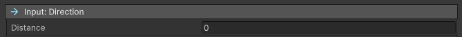
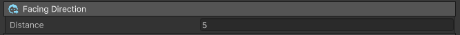

# Target System

## Cast on Self

This targeting system will automatically use the caster as target for the ability at input time ([#2](../#execution-sequence)). It will optionally target multiple targets at activation time ([#5](../#execution-sequence)).

<figure markdown>
  
</figure>

- **Multi Target** : Enable multi target.
- **Radius** : Maximum distance from the target
- **Target Layer** : Physics layer used to detect targets. Targets that are not part of the specified layers will be ignored.
- **Targeting Marker** : Optional indicator which spawns at the target location while the input is being processed. Using the UI input, the indicator will be visible as long as the corresponding button is pressed.

!!! Danger "Physics detection"
Any game object can represent a valid target for the ability, the only requirement is the presence of a collider on it.
In case of problem, please double check that a collider exist on the target and that the ability is properly set to detect that layer

## Cast on Closest Target

This targeting system will look for each potential target in the specified radius around the user location and select the closest one. This method acquires the target at input time ([#2](../#execution-sequence)), meaning that once the animation starts, the target will always get hit. This can be avoided by using requirements.

<figure markdown>
  
</figure>

- **Radius**: Maximum distance from the target location
- **Target Layer** : Physics layer used to detect targets. Targets that are not part of the specified layers will be ignored.

## Cast on Location

This targeting system will automatically use the caster as target for the ability. It will optionally target multiple targets and display a marker on the ground while the input is kept pressed.

<figure markdown>
  
</figure>

- **Radius** : Area of effect - Distance from the center within which targets are selected.
- **Targeting Marker** : Optional indicator which spawns at the target location while the input is being processed. Using the UI input, the indicator will be visible as long as the corresponding button is pressed.
- **Ground Layer **: Physics layer used to draw the indicator on the floor.
- **Target Layer** : Physics layer used to detect targets. Targets that are not part of the specified layers will be ignored.

## Direction

This targeting system will use the direction of the mouse cursor relative to the caster's position.

<figure markdown>
  
</figure>

- **Distance** : distance from the caster's position in the direction of the cursor. If left at 0, then the exact cursor position will be used instead.

## Facing

This targeting system will use the direction of the caster.

<figure markdown>
  
</figure>

- **Distance** : distance from the caster's position in the forward direction.

