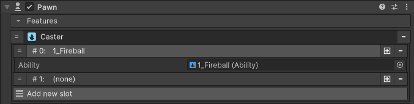
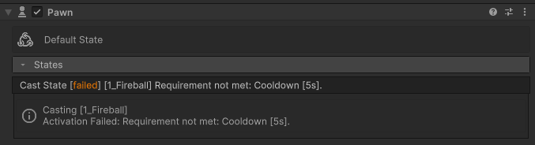

# Caster

Feature that allows the pawn to cast spells. The feature contains a list of ability slots that can be bound to an input action of a [controller](../../../core/systems/input/controller/). Simply adding the feature to a pawn will allow it to cast spells. Slots are used to bind each spell to an input key.

<figure markdown>
  
</figure>

## Cast State

When casting a spell, the caster feature will try to set the pawn state of "Cast State". This is an internal concept which the user does not need to be too concerned about. The interesting part though is that at runtime, useful information isdisplayed in the inspector which can give clues to why the system does not react as expected.

For example, any number of reasons could stop a spell from activating as expected, the cast state will reveal exactly what prevented the cast.

<figure markdown>
  
</figure>