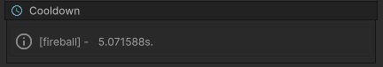

# Cooldown

Feature that allows the pawn to have cooldowns. Required to cast spells with cooldowns.

<figure markdown>
  
</figure>

!!! note "Runtime info"
		You can consult which abilities are on cooldown and for how long in the inspector at runtime.