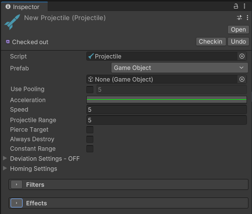
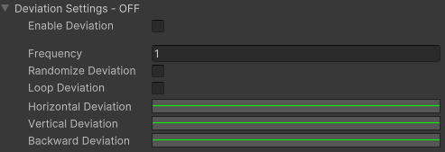
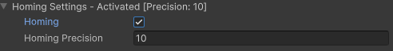
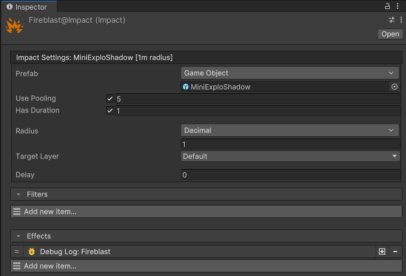

# Projectile & Impacts

## Projectiles

A projectile is a moving game object that works as a "targeting system" that is used to deliver ability effects to the poor soul who ends up colliding with it.

A projectile defines the behavior of a single missile that can be reused in different abilities and be spawned in various ways using the [projectile ability effect](../ability-asset/effects/#projectile).

### Creating a projectile

Projectiles are scriptable objects and to create one, you'll need to right click on the Project Panel and navigate to Create → Game Creator → Abilities → Projectile.

<figure markdown>
  
  <figcaption>Controller example</figcaption>
</figure>

- **Prefab**: the prefab representing the projectile. The projectile is a physics object and is moved through physics, therefore it requires a trigger collider and a rigidbody to work properly. The system will automatically set it up for you, but you can customize the projectile further by adding them yourself.
- **Acceleration**: an animation curve that can be used to control the acceleration of the projectile over the distance between its spawn point and its target.
- **Speed**: the speed at which the projectile travels
- **Projectile range**: range of the projectile, used to determine the maximum travel distance.
- **Pierce Target**: determine if the projectile will be destroyed on contact or if it can hit more targets after the first one.
- **Always Explode**: if enabled, the projectile will always be destroyed, and its effect resolved after reaching its defined *range* (see above)
- **Constant Range**: the projectile will normally adjust its range to the distance between its spawn point and its target. If enabled, the range will always be the one set above (useful for enabling various effects).
- **Filters**: same as abilities, see [documentation](../ability-asset/#filter-system).
- **Effects**: same as abilities, see [documentation](../ability-asset/#effect-system).

!!! danger "Chain effects"
        Although it is possible to add an effect on the projectile to spawn itself, it is not recommended as it can get out of hand and spawn an exponentially increasing number of projectiles. A better way is to spawn a different projectile or an impact instead, this way you always control what a projectile can spawn. Always keep organized and avoid circular dependencies that might crash Unity. 

### Deviation Settings

The settings under this fold out let you customize the trajectory of your projectile using animation curves. The animation curve can be set from 0 to 1 and is mapped to the range of the projectile.

!!! warning "Constraints"
        Always keep the time values between 0 and 1. Any values before 0 and after 1 will be ignored. It is also recommended to keep the Y value between 0 and 1. You can play with the intensity using the Deviation Multiplier field.

<figure markdown>
  
  <figcaption>Controller example</figcaption>
</figure>

- **Loop Deviation**: if enabled, after traveling a distance equal to its range, repeats the deviation curve in a loop over its lifetime.
- **Frequency**: compressed the curve so that it repeats more often over the projectile range. Requires *Loop Deviation*.
- **Randomize Deviation**: pick a random start time on the curve each time the projectile is spawned. Requires *Loop Deviation*.
- **Horizontal Deviation**: curve controlling the horizontal deviation.
- **Vertical Deviation**: curve controlling the vertical deviation.
- **Backward Deviation**: curve controlling the backward deviation.
- **Deviation Multiplier**: multiplies each deviation curve by the corresponding multiplier value.

!!! tip "Be creative"
        With the deviation settings you can easily create projectiles that spiral towards their target, or lob unto them.

!!! tip "Adaptive trajectory"
        If you keep the *constant range* setting off, the deviation will always be mapped from the origin to the target. So if you set the projectile to move along a bell shaped curve, you can be sure that your projectile will always hit the target as expected.

### Homing settings

The settings under this fold out let you modify your projectile to home to its target. The projectile will gradually adjust its direction until it hits its target. The *homing precision* allows you to control how aggressive it adjusts its direction.

<figure markdown>
  
  <figcaption>Controller example</figcaption>
</figure>

## Impact

An Impact represents another tool in your toolbelt to acquire targets and apply effects.

An Impact will gather targets all around it, up to a certain distance and apply the impact effect on them.

### Creating an Impact

Impacts are scriptable objects and to create one, you'll need to right click on the Project Panel and navigate to Create → Game Creator → Abilities → Impact.

<figure markdown>
  
  <figcaption>Controller example</figcaption>
</figure>

- **Prefab**: prefab that is spawned at the impact position. Usually meant to be VFX only. We *highly* recommend using the pooling system on that one.
- **Radius**: distance within which targets are acquired.
- **Delay**: delay after which targets are acquired and effects applied.
- **Filters**: same as abilities, see [documentation](../ability-asset/#filter-system).
- **Effects**: same as abilities, see [documentation](../ability-asset/#effect-system).

!!! tip "Impact delay"
        Sometimes, VFX have a windup/buildup to their visuals, you can use the delay to apply the impact effect at the exact time you impact VFX detonates for maximum impact (pun intended).