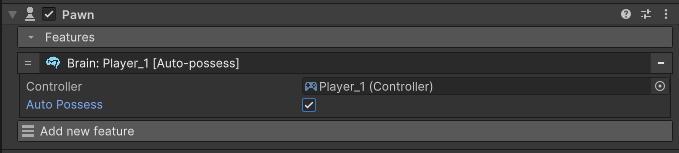

# Brain

Brain is a feature that allows a pawn to be bound to a [controller](../input/controller.md).

- **Controller** : Specify the controller that will be used to take control of the pawn.
- **Auto Possess** : when activated, the pawn will be automatically possessed by the controller upon starting the game.
		
<figure markdown>
  
</figure>

!!! Danger "Only one pawn can be possessed at a time"
		Only one pawn can be possessed at a time, so if multiple pawns are set to be possessed automatically by the same controller, then a random pawn will be possessed instead.