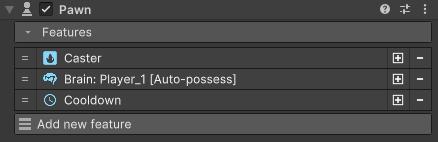
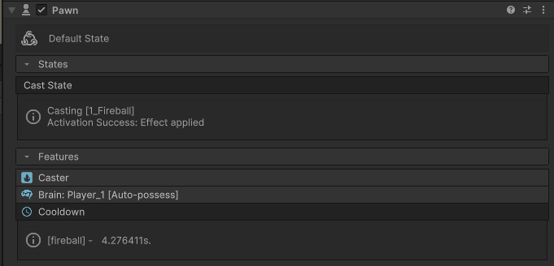

# Pawn Component

Pawn is the main component used to add functionality and configuration to game objects. Through the pawn inspector, you can add and remove various features to customize the behaviour of your game object very easily.

During play, the inspector will display useful information to allow you to understand exactly what is happening at any given time.

You can add a pawn component to your game objects that interact with Daimahou systems by clicking *Add component* in the inspector and navigating to *Game Creator -> Daimahou -> Pawn*

<figure markdown>
   
</figure>

!!! note "Debugging info"
    The pawn component can show useful debugging information during runtime. In case of a problem, feel free to add a screenshot of it to add to your support request as this might help fixing bugs !

# States

An important thing to understand is that a Pawn can have various behaviours depending on the features that are enabled. For example, the motion feature gives the pawn the ability to move while the cast feature will give the ability to cast spells. When engaging in one behaviour, the pawn will enter a corresponding state. Each state will determine if it can be canceled potentially preventing other behaviour to start while the pawn is already busy.

The current state and previously used states can be inspected in the pawn inspector at runtime. Useful information can be found, for example, the reason that prevents a pawn from entering a given state will be written in the inspector to facilitate the debugging and understanding of the system.

States have internal rules that specify when they can or cannot be overridden. For example, the move state can be freely overridden by the cast state, but the other way around.

<figure markdown>
 
</figure>