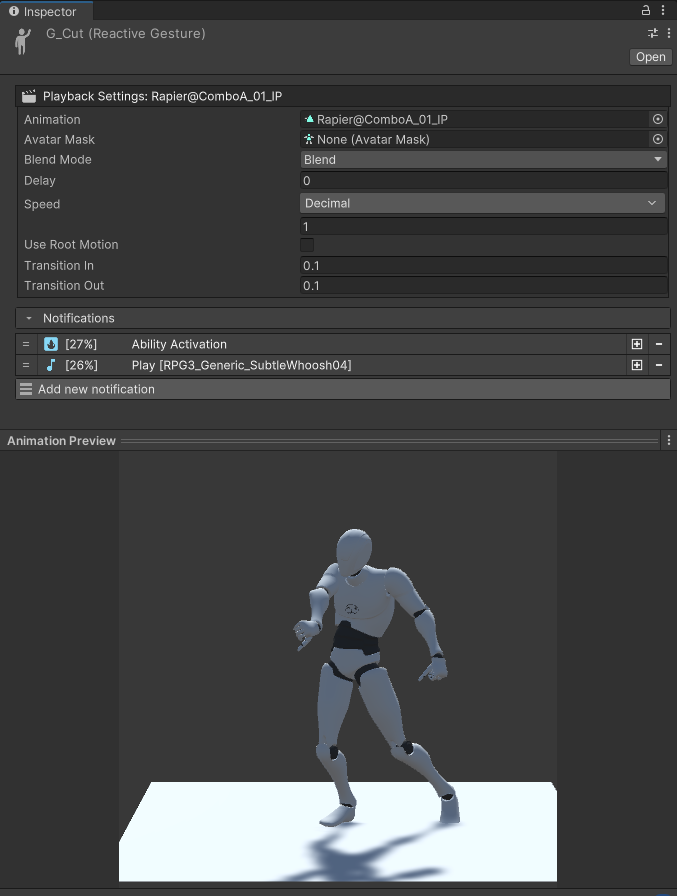

# Reactive Gesture
## Reactive Gesture
Reactive gestures allows to synchronize logic events and store data directly with the animation. This is particularly useful to trigger sound effects and visual effects at the exact timing.

The system is also used to trigger the activation of an ability so that, for example, the damage is only delivered at the exact time the sword connects with the target. Moreover, the system also allows the user to execute custom logic and synchronize its execution with the animation.

## Creating a reactive gesture

Reactive gestures are scriptable objects and to create one, you'll need to right click on the Project Panel and navigate to *Create → Game Creator → Character → Reactive Gesture*.

## Reactive Gesture Inspector

A reactive gesture is a container for an animation. In it, you can define notifications that will be triggered when the animation is played. Each notification can be set to trigger at a specific time during the animation. This system is used to easily synchronize the visual element of the animation with its logic.

<figure markdown>
   
</figure>

## Animation preview

When selected, if the animation clip field is filled with an animation, the animation preview will show the animation in real time. When dragging the slider of a particular notification, the animation will adjust to show the character position at this time frame.

## Notifies

<figure markdown>
   
</figure>

There is 4 different notifications at this time with relatively straightforward behaviour.

- **Ability Activation**: sends a notification to the ability system that will complete its activation.
- **Instantiate Gameobject**: works exactly like the [Game Creator instruction](https://docs.gamecreator.io/gamecreator/visual-scripting/actions/instructions/game-objects/instantiate/). This one can be seen as a shortcut to spawn VFX.
- **Sound effects**: works exactly like the [Game Creator instruction](https://docs.gamecreator.io/gamecreator/visual-scripting/actions/instructions/audio/play-sound-effect/). This one can be seen as a shortcut to spawn SFX.
- **Instructions**: a list of Game Creator instructions that can be used to trigger custom logic.

## Reactive Gesture State

Reactive gesture states are the reactive gesture counterpart of [Game Creator State](https://docs.gamecreator.io/gamecreator/characters/animation/states/).

The only difference is that they include a timeline for the notifications. There is only one notification timeline which covers the entirety of the state, including the optional entry and exit animations. The portion of the notification timeline which corresponds to the looping animation is repeated each loop automatically.

<figure markdown>
   
</figure>